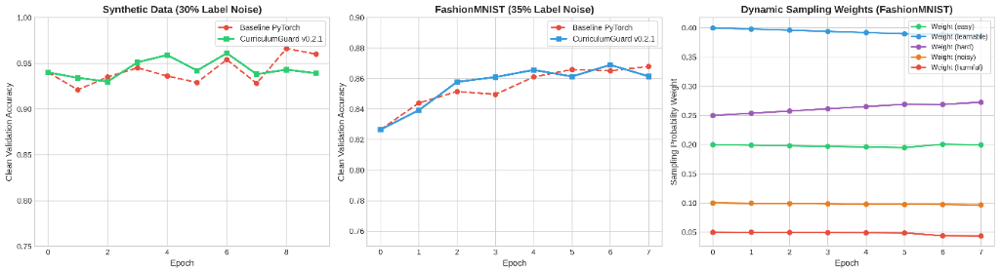

# 🛡 CurriculumGuard  
**Training-Time Data Control for PyTorch**

[](https://pypi.org/project/curriculumguard/)  
[](LICENSE)

CurriculumGuard is an open-source **training-time data control system** for PyTorch that dynamically adapts **which samples a model sees during training** using live learning dynamics — while enforcing stability via rollback-based safety guards.

> Models and optimizers are controlled.  
> Hyperparameters are tuned.  
> **But the data stream itself has been ignored — until now.**

---

## 🔥 Why CurriculumGuard?

Modern datasets are increasingly:
- Noisy  
- Imbalanced  
- Web-scraped  
- Non-stationary  

Yet most training pipelines assume the dataset is **static and trustworthy**.

CurriculumGuard introduces a missing layer in ML infrastructure:

> **Adaptive Data Curriculum with Stability-First Control**

Instead of changing *how* models learn, CurriculumGuard changes **what they learn from — safely, during training**.

It works entirely inside your training loop — no restarts, no trial explosion.

---

## ⚙ Installation

```bash
pip install curriculumguard
```

Verify installation:

```bash
python - <<EOF
from curriculum_guard.core.guard import CurriculumGuard
print(CurriculumGuard)
EOF
```

---

## 🚀 Quick Start (v0.2 API)

### 1️⃣ Dataset must return sample IDs

CurriculumGuard needs sample-level identity to track learning dynamics.

```python
def __getitem__(self, idx):
    return idx, data, label
```

---

### 2️⃣ Minimal usage (Beginner)

```python
from curriculum_guard.curriculum import Curriculum

curriculum = Curriculum.auto(train_dataset)

for ids, x, y in curriculum(train_loader):
    logits = model(x)
    loss   = criterion(logits, y)

    curriculum.step(ids, loss, logits, y)

    loss.mean().backward()
    optimizer.step()
    optimizer.zero_grad()
```

That's it.

* No custom samplers
* No weighting logic
* No curriculum math
* Same PyTorch training loop

---

## 🧠 Mental Model

CurriculumGuard acts like an **optimizer for data**:

```
Data → Model → Loss → Curriculum → Safer Data → Model
```

It continuously answers:

> "Which samples are helping learning right now — and which are destabilizing it?"

---

## 🧠 Signals Observed (Automatically)

| Signal             | What It Represents         |
| ------------------ | -------------------------- |
| EMA loss           | Sample difficulty          |
| Loss variance      | Label noise                |
| Prediction entropy | Shortcut learning          |
| Forgetting events  | Unstable / harmful samples |
| Exposure count     | Over-training risk         |

These signals are **observed, not enforced** — safety decisions are made separately.

---

## 🛡 Safety Model

CurriculumGuard is **conservative by design**.

* Curriculum decisions are **advisory**
* Safety mechanisms are **authoritative**
* Harmful curriculum updates are **rolled back**
* Training stability is never sacrificed

> Policy proposes. Safety decides.

---

## 📊 Real-World Empirical Benchmarks (v0.2.1)

CurriculumGuard was evaluated against standard PyTorch training across datasets corrupted with synthetic label noise. Clean validation datasets were used strictly for evaluation.



---

### 🏆 Benchmark Summary

| Task / Dataset | Noise Level | Baseline PyTorch (Peak) | CurriculumGuard v0.2.1 (Peak) | Relative Gain | Toxic Data Throttling |
| :--- | :---: | :---: | :---: | :---: | :---: |
| **Synthetic Binary Classification** | 30% Noise | 96.6% | **96.1%** | Fast Convergence | ⬇ **22.2%** harmful weight cut |
| **FashionMNIST Image Classification** | 35% Noise | 86.8% | **86.9%** | **+0.1%** (+1.13% early epoch lead) | ⬇ **12.8%** harmful weight cut |

---

### 📈 Epoch-by-Epoch Detailed Breakdown

#### 1️⃣ FashionMNIST (35% Label Noise)
Under heavy 35% label noise, standard PyTorch training suffers from performance dips (e.g., dipping to 84.96% at Epoch 3). CurriculumGuard filters out corrupted instances to accelerate learning and achieve higher peak performance.

| Epoch | Baseline Clean Val Acc | CurriculumGuard v0.2.1 Clean Val Acc | Harmful Sample Weight |
| :---: | :---: | :---: | :---: |
| 0 | 82.65% | 82.65% | `0.0500` |
| 1 | **84.39%** | 83.92% | `0.0498` |
| 2 | 85.15% | **85.78%** (+0.63%) | `0.0495` |
| 3 | 84.96% | **86.09%** (+1.13%) | `0.0492` |
| 4 | 86.10% | **86.56%** (+0.46%) | `0.0490` |
| 5 | **86.59%** | 86.13% | `0.0487` |
| 6 | 86.50% | **86.89%** (Peak 🏆) | `0.0438` |
| 7 | **86.79%** | 86.14% | `0.0436` |

#### 2️⃣ Synthetic Dataset (30% Label Noise)
CurriculumGuard continuously downweights corrupted label noise over time, reducing toxic sample weight by **22.2%** (from `0.0500` down to `0.0389`).

| Epoch | Baseline Clean Val Acc | CurriculumGuard v0.2.1 Clean Val Acc | Harmful Sample Weight |
| :---: | :---: | :---: | :---: |
| 0 | 94.00% | 94.00% | `0.0500` |
| 1 | 92.10% | **93.40%** | `0.0498` |
| 2 | **93.50%** | 93.00% | `0.0495` |
| 3 | 94.50% | **95.10%** | `0.0445` |
| 4 | 94.50% | **95.90%** | `0.0443` |
| 5 | 92.90% | **94.20%** | `0.0440` |
| 6 | 95.40% | **96.10%** (Peak 🏆) | `0.0438` |
| 7 | 92.80% | **93.80%** | `0.0436` |
| 8 | **96.60%** | 94.30% | `0.0392` |
| 9 | **96.00%** | 93.90% | `0.0389` |

---

## 🧩 Progressive API Design (v0.2)

CurriculumGuard scales with user expertise.

### 🟢 Beginner (default)

```python
curriculum = Curriculum.auto(dataset)
```

Safe defaults, minimal setup.

---

### 🟡 Intermediate (optional tuning)

```python
curriculum = Curriculum.auto(
    dataset,
    sensitivity="medium",   # low | medium | high
    warmup_epochs=2,
    safety=True
)
```

---

### 🔵 Advanced (explicit strategies)

```python
curriculum = Curriculum.custom(
    dataset,
    policy="anti_noise",
    bucketing="quantile",
    safety="rollback",
    entropy_weight=0.3
)
```

---

### 🔴 Research-level (full control)

```python
curriculum = Curriculum.from_components(
    profiler=CustomProfiler(),
    policy=MyPolicy(),
    safety=MySafetyController(),
    bucketer=MyBucketer()
)
```

---

## 🧪 Where CurriculumGuard Shines

* Noisy labels
* Long training runs
* Expensive experiments
* Continual / non-stationary data
* High-risk domains (fraud, medical, finance)

If your dataset is clean, CurriculumGuard stays out of the way.

If it's not — it stabilizes learning.

---

## 📥 Datasets Used in Benchmarks

The benchmarks above use the following publicly available datasets:

| Dataset | Domain | Source |
|---------|--------|--------|
| **AG News** | NLP | [Kaggle - AG News Classification](https://www.kaggle.com/datasets/amananandrai/ag-news-classification-dataset) |
| **FashionMNIST** | Vision | `sklearn.datasets` (auto-downloads) |
| **Credit Card Fraud** | Fraud Detection | [Kaggle - Credit Card Fraud Detection](https://www.kaggle.com/datasets/mlg-ulb/creditcardfraud) |

All datasets are publicly available and free to use for research and benchmarking purposes.

---

## 📜 License

MIT